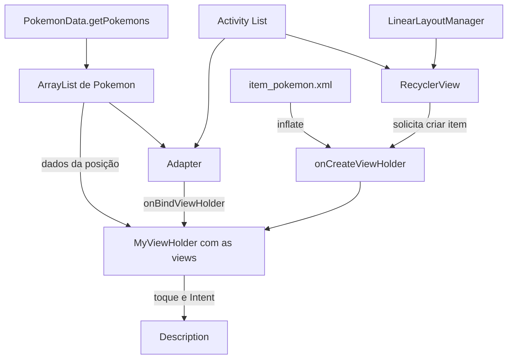

# Pokédex — guia do aplicativo e dos recursos Android

Aplicativo Android escrito em **Java**, com telas em **XML**, para consultar uma lista de Pokémon e abrir seus detalhes. Este README explica o que está implementado, onde cada recurso aparece e como poderia ser ampliado. Os exemplos marcados como **sugestão** são didáticos: não foram adicionados ao funcionamento do aplicativo.


## Consulta rápida para estudo

Use o índice para chegar ao exemplo necessário. **Código atual** reproduz o aplicativo; **equivalente/didático** explica a mesma ideia com simplificações; **sugestão** mostra algo que ainda não foi implementado. Cada exemplo informa o lugar em que deve ser usado. Não cole métodos soltos fora de suas classes nem junte alternativas como se fossem etapas obrigatórias.

| Preciso revisar… | Ir para |
| --- | --- |
| Funcionalidades e mapa de arquivos | [Seções 1–2](#funcionalidades) |
| Intent: enviar, receber e compartilhar | [Seção 4](#intents) |
| Glide: URL, ImageView, placeholder e erro | [Seção 5](#glide) |
| RecyclerView, Adapter e ViewHolder passo a passo, com Adapter completo comentado | [Seção 11](#guia-recyclerview) |
| Java: modelo, construtor, getters, ArrayList, static e callbacks | [Seção 12](#guia-java) |
| Activity, contexto, listeners, ciclo de vida e insets | [Seção 13](#guia-activity) |
| Toque longo e AlertDialog | [Seção 14](#guia-eventos) |
| XML, recursos, temas e Manifest | [Seção 15](#guia-xml) |
| Receitas, erros comuns, perguntas e exercícios | [Seção 16](#guia-consulta) |

<a id="funcionalidades"></a>

## 1. Funcionalidades implementadas

| Funcionalidade | Como funciona | Onde está |
| --- | --- | --- |
| Tela inicial | Exibe o símbolo, o título e o botão “Abrir Pokédex”. | `MainActivity.java` e `activity_main.xml` |
| Navegação para a lista | O botão abre a Activity `List` com uma Intent explícita. | `MainActivity.onCreate()` |
| Catálogo local | Cria 20 objetos: Bulbasaur até Rattata (números 1 a 19 nas URLs), mais Pikachu (25). | `PokemonData.getPokemons()` |
| Lista com rolagem vertical | Mostra nome, tipo, descrição resumida e imagem de cada Pokémon. | `List.java`, `Adapter.java` e `item_pokemon.xml` |
| Imagens remotas | Carrega sprites por URLs HTTPS usando Glide. Na lista, há imagem de espera e de erro. | `Adapter.onBindViewHolder()` |
| Tela de detalhes | Um toque no item abre nome, tipo, descrição e imagem do Pokémon escolhido. | `Adapter.MyViewHolder` e `Description.java` |
| Exclusão com confirmação | Um toque longo abre um diálogo; “Sim” remove o item e “Não” cancela. | `Adapter.MyViewHolder` |
| Retorno entre telas | Utiliza a pilha padrão de Activities e o botão/gesto Voltar do Android. | Navegação padrão, sem implementação própria |
| Tema claro e escuro | Recursos de tema diferentes são selecionados conforme o modo do sistema. | `res/values/themes.xml` e `res/values-night/themes.xml` |
| Ajuste às barras do sistema | As telas ativam edge-to-edge e aplicam insets para posicionar o conteúdo. | `onCreate()` das três Activities |
| Rolagem nos detalhes | O conteúdo está dentro de um `NestedScrollView`. | `activity_description.xml` |

**Limites atuais:** não há pesquisa, filtros, cadastro, edição, favoritos, login, banco de dados ou consulta JSON à PokeAPI. Os textos estão no código; somente as imagens são buscadas na internet. Excluir um item altera a lista em memória, sem gravar a exclusão. Uma nova instância da tela de lista cria novamente os 20 Pokémon, inclusive após uma recriação da Activity.

## 2. Organização e responsabilidade das classes

Os caminhos Java abaixo ficam dentro de `app/src/main/java/com/example/pokedex/`.

| Arquivo | Responsabilidade |
| --- | --- |
| `MainActivity.java` | Montar a tela inicial e abrir a lista. |
| `List.java` | Obter os dados e configurar o RecyclerView. |
| `Adapter.java` | Criar/preencher os itens, carregar imagens e tratar toques, navegação e exclusão. |
| `Description.java` | Ler os extras da Intent e preencher a tela de detalhes. |
| `model/Pokemon.java` | Representar os dados de um Pokémon, sem depender de telas Android. |
| `PokemonData.java` | Construir uma nova lista de dados locais a cada chamada. |

### Modelo (`model/Pokemon.java`)

A classe `Pokemon` já existia como modelo. Sua organização no pacote `model` apenas separa os dados das telas; não cria um segundo modelo nem altera o construtor ou os getters.

| Campo privado | Conteúdo | Método de leitura |
| --- | --- | --- |
| `nome` | Nome, como `Pikachu`. | `getNome()` |
| `tipo` | Texto, como `Elétrico` ou `Planta / Veneno`. | `getTipo()` |
| `descricao` | Descrição apresentada no aplicativo. | `getDescricao()` |
| `imagem` | URL da imagem, não um Bitmap ou arquivo baixado. | `getImagem()` |

Exemplo de uso do modelo, com a mesma ordem de argumentos do construtor existente:

```java
import com.example.pokedex.model.Pokemon;

Pokemon pikachu = new Pokemon(
        "Pikachu",
        "Elétrico",
        "Armazena eletricidade em suas bochechas.",
        "https://raw.githubusercontent.com/PokeAPI/sprites/master/sprites/pokemon/25.png"
);
String nome = pikachu.getNome();
```

Os campos são privados e não há setters públicos. O modelo não é uma Activity, não carrega imagens e não implementa `Parcelable` ou `Serializable`. Portanto, o aplicativo envia seus campos separados pela Intent. Modelo também não é `ViewModel`: um guarda dados de domínio; o outro pode gerenciar estado da interface durante mudanças de configuração.

`PokemonData.getPokemons()` usa `ArrayList<Pokemon>`, adiciona os objetos com `add()` e retorna a coleção. `List` entrega essa mesma coleção ao Adapter. Por isso, a remoção feita pelo Adapter afeta a coleção mantida pela tela. Uma nova chamada ao método cria outra coleção, com todos os registros originais.

## 3. Activities, layouts e ciclo de vida

Todas as telas herdam de `AppCompatActivity`. Em `onCreate(Bundle savedInstanceState)`, chamam `super.onCreate()`, ativam `EdgeToEdge`, escolhem um layout com `setContentView()` e localizam componentes com `findViewById()`.

- `setContentView(R.layout.activity_main)` associa a tela ao XML.
- `findViewById(R.id.button)` recupera o botão declarado nesse layout.
- `setOnClickListener()` define a ação executada quando o usuário toca.
- `TextView.setText()` coloca os dados recebidos nos campos visuais.
- `R` é a classe de referências gerada a partir dos recursos Android; não é um arquivo para editar manualmente.

O parâmetro `savedInstanceState` é recebido, mas não existe lógica própria para salvar/restaurar a lista modificada. A volta de `Description` para uma instância ainda existente de `List` preserva sua coleção; recriar `List` executa a carga inicial novamente.

### XML e recursos visuais

| Recurso | Uso no projeto |
| --- | --- |
| `ConstraintLayout` | Posiciona componentes por relações com o pai e com outras views. |
| `MaterialCardView` | Cria os cartões da lista e dos detalhes, com borda, elevação e cantos arredondados. |
| `NestedScrollView` | Envolve o conteúdo da descrição; possui um filho direto. |
| `ImageView` | Mostra o símbolo local ou a imagem carregada pelo Glide. |
| `TextView` e `Button` | Exibem textos e permitem abrir a Pokédex. |
| `@drawable/symbol` | Imagem local usada na interface e como placeholder/erro na lista. |
| `@font/font_oxanium_semibold` | Fonte aplicada a títulos e ao botão. |
| `?attr/colorSurface` e cores do tema | Permitem adaptar parte da interface ao modo claro/escuro. |
| `tools:text`, `tools:src`, `tools:listitem` | Ajudam a visualizar o layout no editor; não fornecem dados em execução. |

No item, `maxLines="3"` e `ellipsize="end"` limitam a descrição e acrescentam reticências quando necessário. A tela de detalhes recebe a descrição completa. Dimensões usam `dp` e tamanhos de texto usam `sp`.

### Edge-to-edge e insets

`EdgeToEdge.enable(this)` permite desenhar a janela até suas bordas. O listener de `ViewCompat.setOnApplyWindowInsetsListener()` obtém os espaços ocupados pelas barras com `WindowInsetsCompat.Type.systemBars()`.

Em `MainActivity` e `List`, os paddings originais são capturados antes do listener e somados aos insets. Isso mantém o espaçamento do XML sem acumular valores em chamadas repetidas. Em `Description`, os insets são aplicados à raiz e o espaçamento visual fica no layout filho. Se futuramente for colocado padding na raiz dessa tela, será necessário preservá-lo também.

<a id="intents"></a>

## 4. Intent: navegação, envio e recebimento

Uma Intent descreve uma ação. A **explícita** indica a classe de destino; a **implícita** informa uma ação e os dados, permitindo que o Android encontre um aplicativo compatível. O projeto usa Intents explícitas nas duas navegações internas. [Referência: Intents e filtros](https://developer.android.com/guide/components/intents-filters).

### 4.1 Abrir uma tela sem enviar dados — implementado

Trecho de `MainActivity.onCreate()`:

```java
Intent intent = new Intent(MainActivity.this, List.class);
startActivity(intent);
```

`MainActivity.this` fornece o contexto da Activity de origem. `List.class` identifica o destino registrado no Manifest. Não há extras nessa navegação: a própria tela de lista consulta `PokemonData`.

### 4.2 Enviar os dados do Pokémon — implementado

No clique de `Adapter.MyViewHolder`, depois de validar a posição:

```java
Intent intent = new Intent(view.getContext(), Description.class);
intent.putExtra("Nome", list.get(position).getNome());
intent.putExtra("Tipo", list.get(position).getTipo());
intent.putExtra("Imagem", list.get(position).getImagem());
intent.putExtra("Descricao", list.get(position).getDescricao());
view.getContext().startActivity(intent);
```

`putExtra(chave, valor)` adiciona cada valor à mensagem. Aqui todos são `String`. O contexto vem da view do item, criada na tela de lista. Não são enviados a coleção inteira, o objeto `Pokemon` nem os bytes da imagem: segue apenas a URL.

### 4.3 Receber os dados — implementado

Em `Description.onCreate()`:

```java
String nome = getIntent().getStringExtra("Nome");
String tipo = getIntent().getStringExtra("Tipo");
String imagem = getIntent().getStringExtra("Imagem");
String descricao = getIntent().getStringExtra("Descricao");

txtNome.setText(nome);
textType.setText(tipo);
textDescription.setText(descricao);
Glide.with(this).load(imagem).into(imgAvatar);
```

As chaves diferenciam maiúsculas/minúsculas: `"Nome"` e `"nome"` são diferentes. Uma chave ausente pode resultar em `null`. A tela atual não valida os quatro valores antes de exibi-los. Para melhorar, centralizar as chaves em constantes compartilhadas e definir se dados ausentes devem gerar uma mensagem, valor padrão ou encerramento da tela.

Exemplo **sugerido**, dentro de `Description.onCreate()` após localizar as views:

```java
String nome = getIntent().getStringExtra("Nome");
txtNome.setText(nome == null || nome.trim().isEmpty()
        ? "Pokémon sem nome" : nome);
```

É possível enviar números e booleanos usando `putExtra()` e lê-los com métodos como `getIntExtra("Id", -1)` e `getBooleanExtra("Favorito", false)`. Para um objeto próprio, é necessário um mecanismo compatível, como `Parcelable`; não basta passar o `Pokemon` atual diretamente. Em um catálogo com armazenamento, outra opção é enviar só um identificador e consultar os dados no destino. Evite colocar imagens completas ou listas grandes nos extras.

### 4.4 Enviar informações a outro aplicativo — sugestão

Exemplo para um futuro botão de compartilhar em `Description`, usando as variáveis `nome`, `tipo` e `descricao` já lidas:

```java
Intent compartilhar = new Intent(Intent.ACTION_SEND);
compartilhar.setType("text/plain");
compartilhar.putExtra(Intent.EXTRA_TEXT,
        nome + " — " + tipo + "\n" + descricao);
try {
    startActivity(Intent.createChooser(compartilhar, "Compartilhar Pokémon"));
} catch (android.content.ActivityNotFoundException e) {
    android.widget.Toast.makeText(this,
            "Nenhum aplicativo disponível para compartilhar.",
            android.widget.Toast.LENGTH_SHORT).show();
}
```

`ACTION_SEND` informa a ação, `text/plain` informa o formato e `EXTRA_TEXT` contém o texto. O seletor permite escolher entre os aplicativos compatíveis instalados; não garante que um aplicativo específico esteja disponível. Compartilhar a URL como texto não equivale a enviar o arquivo da imagem. Para arquivos, use uma URI `content://`, por exemplo via `FileProvider`, `EXTRA_STREAM`, o MIME correto e permissão temporária de leitura. [Referência: envio a outros aplicativos](https://developer.android.com/training/sharing/send).

### 4.5 Abrir um endereço externo — sugestão

Exemplo dentro de uma Activity, para abrir a página da PokeAPI em um aplicativo capaz de exibir HTTPS:

```java
Intent abrirSite = new Intent(Intent.ACTION_VIEW,
        android.net.Uri.parse("https://pokeapi.co/"));
try {
    startActivity(abrirSite);
} catch (android.content.ActivityNotFoundException e) {
    android.widget.Toast.makeText(this,
            "Nenhum aplicativo disponível para abrir o endereço.",
            android.widget.Toast.LENGTH_SHORT).show();
}
```

Aqui o endereço vai em `Intent.getData()` no lado receptor, e não no extra `"Imagem"`. Quem escolhe a forma de ler é o contrato da ação utilizada. [Referência: Intents comuns](https://developer.android.com/guide/components/intents-common).

### 4.6 Receber texto compartilhado por outro app — sugestão

O aplicativo atual não recebe compartilhamentos externos. Uma futura Activity receptora precisaria estar declarada com `android:exported="true"` e um filtro para a ação e o MIME aceitos. Não é necessário tornar `Description` pública para compartilhar dados para fora.

Filtro ilustrativo, dentro da declaração de uma futura Activity receptora:

```xml
<intent-filter>
    <action android:name="android.intent.action.SEND" />
    <category android:name="android.intent.category.DEFAULT" />
    <data android:mimeType="text/plain" />
</intent-filter>
```

Leitura sugerida dentro dessa Activity:

```java
Intent entrada = getIntent();
if (Intent.ACTION_SEND.equals(entrada.getAction())
        && "text/plain".equals(entrada.getType())) {
    String texto = entrada.getStringExtra(Intent.EXTRA_TEXT);
    if (texto != null && !texto.trim().isEmpty()) {
        // Validar o conteúdo e então exibir ou processar o texto.
    }
}
```

Um texto externo não vem automaticamente separado em nome, tipo e descrição. É necessário definir e validar como usá-lo. Se a Activity for reutilizada por um modo de lançamento que entrega novas Intents, também é preciso tratar `onNewIntent()`. [Referência: recebimento de compartilhamentos](https://developer.android.com/training/sharing/receive).

### 4.7 Abrir uma tela e receber uma resposta — sugestão

O app usa `startActivity()` e não espera uma resposta dos detalhes. Para uma futura seleção/edição, use a Activity Result API. Registre o launcher de forma incondicional na Activity chamadora, por exemplo como campo:

```java
private final androidx.activity.result.ActivityResultLauncher<Intent> detalhesLauncher =
        registerForActivityResult(
                new androidx.activity.result.contract.ActivityResultContracts.StartActivityForResult(),
                resultado -> {
                    Intent dados = resultado.getData();
                    if (resultado.getResultCode() == RESULT_OK && dados != null) {
                        String nomeSelecionado = dados.getStringExtra("NomeSelecionado");
                        // Validar nomeSelecionado e atualizar a interface.
                    }
                });
```

No clique, monte uma Intent para `Description` com os mesmos quatro extras da seção 4.2 e use `detalhesLauncher.launch(intent)` em lugar de `startActivity(intent)`. Em uma futura ação de confirmação na tela de destino:

```java
Intent resposta = new Intent();
resposta.putExtra("NomeSelecionado", nome);
setResult(RESULT_OK, resposta);
finish();
```

O exemplo exige implementar os dois lados. O retorno comum pelo botão Voltar não passa a produzir `RESULT_OK` automaticamente. Para código novo, a documentação recomenda a Activity Result API em vez de `startActivityForResult()`/`onActivityResult()`. [Referência: resultados de Activities](https://developer.android.com/training/basics/intents/result).

<a id="glide"></a>

## 5. Glide: instalação e uso real

Em `app/build.gradle.kts`, a dependência declarada é:

```kotlin
implementation("com.github.bumptech.glide:glide:4.16.0")
```

As classes Java importam `com.bumptech.glide.Glide`. O projeto utiliza diretamente `Glide.with(...)`, sem uma API gerada `GlideApp`. [Referência: configuração e uso do Glide v4](https://bumptech.github.io/glide/doc/getting-started.html).

### Na lista: `Adapter.onBindViewHolder()`

```java
Glide.with(holder.itemView)
        .load(list.get(position).getImagem())
        .placeholder(R.drawable.symbol)
        .error(R.drawable.symbol)
        .into(holder.imgAvatar);
```

| Chamada | Papel nesta implementação |
| --- | --- |
| `with(holder.itemView)` | Obtém o gerenciador de carregamento a partir da view do item. |
| `load(...)` | Recebe a URL guardada no modelo. |
| `placeholder(...)` | Define o recurso exibido durante o carregamento. |
| `error(...)` | Define o recurso usado quando o carregamento falha. |
| `into(...)` | Define o `ImageView` que receberá o resultado. |

O Glide faz o carregamento sem exigir que o aplicativo implemente uma thread de download e trata a reutilização do alvo em novas requisições. Seu cache pode reutilizar imagens em memória/disco; isso não garante disponibilidade permanente sem internet. [Uso básico](https://bumptech.github.io/glide/doc/getting-started.html), [placeholders](https://bumptech.github.io/glide/doc/placeholders.html) e [cache](https://bumptech.github.io/glide/doc/caching.html).

### Nos detalhes: `Description.onCreate()`

```java
Glide.with(this).load(imagem).into(imgAvatar);
```

`this` é a Activity, `imagem` veio da Intent e `imgAvatar` referencia `R.id.imagePokemon`. Essa requisição não configura placeholder nem erro. O `android:src` do XML não substitui uma configuração de tratamento de falha do Glide.

Melhoria **sugerida**, sem alteração no código atual:

```java
Glide.with(this)
        .load(imagem)
        .placeholder(R.drawable.symbol)
        .error(R.drawable.symbol)
        .fallback(R.drawable.symbol)
        .into(imgAvatar);
```

`fallback()` permite definir o recurso para um modelo nulo. Na lista, sem um fallback específico, a configuração de erro também pode cobrir esse caso. A biblioteca também pode carregar recursos locais e URIs, conforme o tipo aceito em `load()`. [Referência: placeholders, erros e fallback](https://bumptech.github.io/glide/doc/placeholders.html).

## 6. RecyclerView, Adapter e ViewHolder

`RecyclerView` exibe coleções reutilizando views de itens. No projeto, o XML declara `recyclerPokemon` e `List.onCreate()` configura:

```java
list = PokemonData.getPokemons();
adapter = new Adapter(list);
recyclerView = findViewById(R.id.recyclerPokemon);

RecyclerView.LayoutManager layoutManager = new LinearLayoutManager(this);
recyclerView.setLayoutManager(layoutManager);
recyclerView.setHasFixedSize(true);
recyclerView.setAdapter(adapter);
```

`LinearLayoutManager(this)` organiza uma lista vertical. `setHasFixedSize(true)` indica que mudanças nos itens não alteram o tamanho do **próprio RecyclerView**; não obriga todos os cartões a terem a mesma altura. Aqui a área da lista é delimitada pelas constraints do layout. Para outro formato de apresentação, seria possível usar `GridLayoutManager`. [Referência: RecyclerView](https://developer.android.com/develop/ui/views/layout/recyclerview).

### Métodos existentes no Adapter

| Método/classe | O que faz no aplicativo |
| --- | --- |
| `Adapter(ArrayList<Pokemon> list)` | Guarda a coleção recebida, sem copiá-la. |
| `onCreateViewHolder()` | Infla `item_pokemon.xml` e cria um `MyViewHolder`. |
| `onBindViewHolder()` | Preenche nome, tipo, descrição e imagem do item na posição solicitada. |
| `getItemCount()` | Retorna `list.size()`, a quantidade atual de itens. |
| `MyViewHolder` | Guarda referências às quatro views e instala os listeners de clique. |
| `setOnItemClickListener()` | Permite registrar um listener externo; `List` não o utiliza atualmente. |

`LayoutInflater.from(parent.getContext()).inflate(R.layout.item_pokemon, parent, false)` transforma o XML em view. O pai fornece os parâmetros de layout; `false` deixa a anexação por conta do RecyclerView.

O clique consulta `getBindingAdapterPosition()` no momento da interação. Se o resultado for `RecyclerView.NO_POSITION`, o código interrompe a operação. Essa proteção é relevante porque posições podem mudar após uma remoção; não se deve guardar a posição antiga de `onBindViewHolder()` para usá-la mais tarde.

### Listeners: o que realmente é chamado

A interface `OnItemClickListener` declara `onItemClick(int position)` e `onItemLongClick(int position)`. O clique simples chama `listener.onItemClick(position)` se houver listener, mas depois abre `Description` diretamente. O clique longo **não chama** `listener.onItemLongClick(position)`; ele executa o diálogo no próprio Adapter.

Para uma organização futura, deixar navegação e decisões da tela na Activity e fazer o Adapter apenas comunicar os eventos. Nesse caso, escolher um único responsável por abrir os detalhes, evitando que um listener novo abra a tela e o Adapter a abra novamente.

## 7. Toque longo, AlertDialog e exclusão

O fluxo em `Adapter.MyViewHolder` é:

1. Consultar a posição e abandonar a ação se ela for inválida.
2. Obter o Pokémon e criar `AlertDialog.Builder(view.getContext())`.
3. Definir o título “Excluir” e a mensagem com o nome.
4. Em “Sim”, consultar novamente a posição, remover com `list.remove(currentPosition)` e avisar a interface com `notifyItemRemoved(currentPosition)`.
5. Em “Não”, fechar o diálogo sem remover nada. `setNegativeButton("Não", null)` não instala uma ação extra.
6. Chamar `show()` para exibir o diálogo. O listener retorna `true` para indicar que o toque longo foi consumido.

Remover da coleção muda os dados; notificar o Adapter informa qual item visual desapareceu. Uma operação não substitui a outra. O fluxo atual é adequado à coleção simples em memória. Se no futuro ela receber atualizações assíncronas enquanto o diálogo estiver aberto, a confirmação deverá identificar o Pokémon por um ID estável para garantir que seja removido o registro apresentado na mensagem.

## 8. Manifest, permissões e dependências

Em `app/src/main/AndroidManifest.xml`:

- `INTERNET` permite buscar as imagens remotas. É uma permissão normal: não requer um diálogo de autorização em tempo de execução.
- `MainActivity` tem `exported="true"` e o filtro `MAIN`/`LAUNCHER`, usado para abrir o aplicativo pelo lançador.
- `List` e `Description` têm `exported="false"`; são telas internas.
- `Theme.Pokedex`, ícones e `app_name` definem a apresentação do aplicativo.
- `allowBackup`, `dataExtractionRules` e `fullBackupContent` configuram backup de dados elegíveis; não transformam a coleção em memória em dados persistentes.
- `adjustResize` está declarado nas Activities, embora as telas atuais não tenham entrada de texto.

Configuração registrada no projeto (não é uma recomendação para atualizar versões):

| Item | Valor/uso |
| --- | --- |
| Linguagem do app | Java, compatibilidade de fonte/alvo 11 |
| Interface | Android Views com XML |
| `minSdk` | 24 (Android 7.0) |
| `compileSdk` / `targetSdk` | 37 / 37 |
| Android Gradle Plugin | 9.3.3 |
| Gradle Wrapper | 9.5.0 |
| JVM do daemon Gradle | Java 25, conforme `gradle/gradle-daemon-jvm.properties` |
| Glide | 4.16.0 |
| RecyclerView | 1.4.0 |
| AppCompat / Material / ConstraintLayout | Base das Activities, componentes visuais e layouts |
| Activity KTX | Dependência AndroidX Activity declarada no projeto |
| JUnit / AndroidX Test / Espresso | Bibliotecas de testes declaradas |

As versões via `libs.*` vêm de `gradle/libs.versions.toml`. A compatibilidade Java 11 do código não significa que o Gradle deve ser executado em um JDK 11; use um JDK compatível com as versões de Gradle e do plugin declaradas.

## 9. Melhorias recomendadas — apenas documentadas

| Situação encontrada | Forma recomendada de evoluir |
| --- | --- |
| Quatro chaves de Intent repetidas como literais. | Centralizar constantes e validar os extras no destino. |
| A tela de detalhes não configura erro/placeholder do Glide. | Configurar recursos de espera, falha e, se desejado, valor nulo. |
| Exclusões desaparecem quando a lista é recriada. | Usar `ViewModel` para estado durante mudanças de configuração; para manter dados entre sessões, adicionar persistência, como Room. Um `ViewModel` sozinho não sobrevive à morte do processo. |
| Adapter concentra apresentação, navegação e exclusão. | Comunicar ações à Activity por callbacks e separar persistência em uma camada de dados quando ela existir. |
| `onItemLongClick()` é declarado, mas não é chamado. | Utilizar efetivamente esse callback ou removê-lo quando a interface for revisada. |
| Um listener de clique e o Adapter podem ambos navegar. | Definir um único responsável pela navegação. |
| Classes chamadas `List`, `Description` e `Adapter`. | Preferir nomes como `PokemonListActivity`, `PokemonDetailActivity` e `PokemonAdapter`; `List` também pode gerar confusão com `java.util.List`. |
| Textos de telas e diálogo estão diretamente no XML/Java. | Extrair textos de interface para `strings.xml`, incluindo a confirmação com parâmetro para o nome. |
| Campos do modelo não são `final`, embora não haja setters. | Para dados imutáveis, declarar os campos `final` e definir validação conforme os requisitos. |
| Tipos e imagens são representados apenas por Strings. | Se necessário, introduzir ID estável e uma representação estruturada dos tipos; não é obrigatório para esta demonstração. |
| A exclusão depende de um gesto pouco visível. | Considerar um botão/menu de ação acessível e fácil de descobrir. |
| Imagens de Pokémon têm `contentDescription="@null"`. | Manter nulo se forem decorativas e os textos já transmitirem a informação; descrever se a imagem trouxer informação adicional. Validar a experiência com TalkBack. |
| Testes atuais são exemplos de soma e nome do pacote. | Testar o catálogo, navegação, leitura de extras e confirmação/cancelamento de exclusão ao desenvolver essas funcionalidades. |

Usar extras separados, dados locais e um Adapter simples não é, por si só, um erro. As mudanças acima devem acompanhar a necessidade do aplicativo. Não foram aplicadas correções de lógica, mudanças de telas ou novas dependências nesta documentação.

## 10. Como executar e conferir o comportamento

1. Abrir a pasta do projeto no Android Studio e sincronizar o Gradle.
2. Ter o SDK correspondente ao `compileSdk` instalado e um JDK compatível com o build.
3. Executar em aparelho/emulador com API 24 ou superior.
4. Tocar em “Abrir Pokédex”, percorrer os 20 itens e abrir um Pokémon.
5. Conferir nome, tipo, descrição e imagem na tela de detalhes; retornar pelo gesto/botão Voltar.
6. Manter um item pressionado: “Não” deve preservá-lo; “Sim” deve removê-lo da lista atual.
7. Sair da tela de lista e abri-la novamente: os dados originais devem reaparecer.
8. Conferir temas claro/escuro e, sem conexão, uma imagem ainda não armazenada em cache: a lista deve usar o recurso de erro.

Comandos de verificação no terminal Windows, a partir da raiz:

```powershell
.\gradlew.bat :app:assembleDebug
.\gradlew.bat :app:testDebugUnitTest
```

Compilar não confirma o funcionamento visual em um dispositivo. Os testes de exemplo existentes também não cobrem os fluxos acima.

### Verificação da organização do modelo — 08/10/2026

- Conferência das classes: o corpo de `Pokemon` foi preservado; somente seu pacote e os imports em `Adapter`, `List` e `PokemonData` mudaram.
- `Pokemon` e `PokemonData` compilaram com `javac --release 11`.
- A tentativa de `:app:assembleDebug :app:testDebugUnitTest`, em modo offline, parou na geração dos acessores de dependências do Gradle. A causa reportada foi `AccessDeniedException` no arquivo `javax.inject-1.jar` da distribuição local do Gradle, dentro de `.gradle/codex-user-home/wrapper/dists/`.
- Portanto, a compilação Android completa e a execução dos testes não foram confirmadas. Não houve teste em aparelho ou emulador.

<a id="guia-recyclerview"></a>

## 11. Guia prático: montar e entender o RecyclerView

**Objetivo de estudo:** conseguir explicar cada peça e reconstruir a lista usando o código do próprio projeto. Os exemplos desta seção mantêm os nomes reais: a Activity é `List`, o adaptador é `Adapter` e o modelo é `Pokemon`.

### 11.1 Quem faz o quê?

| Peça | Pergunta que ela responde | No aplicativo |
| --- | --- | --- |
| Modelo | Quais informações um registro possui? | `Pokemon`: nome, tipo, descrição e URL. |
| Coleção | Quais registros existem e em qual ordem? | `ArrayList<Pokemon> list`. |
| RecyclerView | Em qual componente a coleção aparece e rola? | View `recyclerPokemon`. |
| LayoutManager | Como os itens ficam posicionados? | `LinearLayoutManager`, vertical. |
| Layout do item | Qual a aparência de um registro? | `item_pokemon.xml`. |
| Adapter | Como transformar cada registro em conteúdo visual? | `Adapter`. |
| ViewHolder | Onde estão as views de um item já criado? | `MyViewHolder`. |
| Activity | Quem prepara a tela e conecta as peças? | `List.onCreate()`. |



O XML do item não contém os 20 Pokémon. Ele define um **formato reutilizável**. O Adapter preenche esse formato usando um registro da coleção por vez. O ViewHolder não é o Pokémon: é um objeto que guarda referências a `TextView`, `ImageView` e à view raiz daquele item.

### 11.2 A sequência durante a execução

1. `List.onCreate()` carrega os dados e entrega o Adapter ao RecyclerView.
2. O RecyclerView consulta a quantidade de itens por `getItemCount()`.
3. Quando precisa de uma nova estrutura visual, chama `onCreateViewHolder()`.
4. Esse método infla o XML e devolve um `MyViewHolder`.
5. `onBindViewHolder(holder, position)` preenche o holder com os dados da posição solicitada.
6. Durante a rolagem, estruturas existentes podem ser reutilizadas para outros registros; o método de binding atualiza seu conteúdo.

Não existe a garantia de um holder permanente por Pokémon ou de uma única chamada de binding por registro. Por exemplo: uma estrutura que mostrava Bulbasaur pode depois mostrar Squirtle. Por isso o binding precisa definir todos os estados visuais que variam entre itens. Não deixe texto, visibilidade, cor ou seleção de um item anterior escapar para o próximo. [Referência: Adapter](https://developer.android.com/reference/androidx/recyclerview/widget/RecyclerView.Adapter).

### 11.3 Preparar as dependências

No projeto, estas linhas já estão em `dependencies` de `app/build.gradle.kts`:

```kotlin
implementation(libs.recyclerview)
implementation(libs.constraintlayout)
implementation(libs.material)
implementation("com.github.bumptech.glide:glide:4.16.0")
```

`libs.recyclerview` é um alias do catálogo `gradle/libs.versions.toml`; não é um import Java. A dependência disponibiliza a biblioteca ao projeto. Já `import androidx.recyclerview.widget.RecyclerView;` permite usar seu nome curto dentro de uma classe Java. Depois de alterar dependências, sincronize o Gradle no Android Studio.

### 11.4 Criar a área da lista no XML

Trecho real de `activity_list.xml`, dentro do `ConstraintLayout` que também contém `textTitle`:

```xml
<androidx.recyclerview.widget.RecyclerView
    android:id="@+id/recyclerPokemon"
    android:layout_width="0dp"
    android:layout_height="0dp"
    android:layout_marginTop="24dp"
    android:clipToPadding="false"
    android:paddingBottom="16dp"
    app:layout_constraintBottom_toBottomOf="parent"
    app:layout_constraintEnd_toEndOf="parent"
    app:layout_constraintStart_toStartOf="parent"
    app:layout_constraintTop_toBottomOf="@id/textTitle"
    tools:listitem="@layout/item_pokemon" />
```

`0dp` neste `ConstraintLayout` significa que a dimensão é determinada pelas constraints. A largura vai do início ao fim do pai; a altura vai de baixo de `textTitle` até a parte inferior do pai. `tools:listitem` só configura a prévia do editor: o Adapter continua necessário em execução. `clipToPadding="false"` permite desenhar na região de padding durante a rolagem.

### 11.5 Criar as views de um item

O projeto já tem `item_pokemon.xml`, com `MaterialCardView` e quatro IDs essenciais ao Adapter:

| ID no item XML | Tipo no Java | Dado preenchido |
| --- | --- | --- |
| `txtNome` | `TextView` | `pokemon.getNome()` |
| `textType` | `TextView` | `pokemon.getTipo()` |
| `textDescription` | `TextView` | `pokemon.getDescricao()` |
| `imgAvatar` | `ImageView` | `pokemon.getImagem()` via Glide |

Se trocar o nome de um ID no XML, ajuste o `findViewById()` correspondente. Os IDs de nome e imagem na tela de detalhes são outros: `textName` e `imagePokemon`. O nome da variável Java não precisa ser igual ao ID, mas o ID procurado precisa existir na árvore de views correta.

### 11.6 Entender a declaração e o construtor do Adapter

```java
public class Adapter extends RecyclerView.Adapter<Adapter.MyViewHolder> {
    private ArrayList<Pokemon> list;

    public Adapter(ArrayList<Pokemon> list) {
        this.list = list;
    }

    // Os métodos e o MyViewHolder aparecem na versão completa abaixo.
}
```

- `extends` declara que `Adapter` herda de `RecyclerView.Adapter`.
- `<Adapter.MyViewHolder>` informa qual tipo de holder esse Adapter cria e preenche.
- `ArrayList<Pokemon>` restringe os elementos da coleção ao tipo `Pokemon`.
- `this.list` é o campo do objeto; `list`, à direita, é o parâmetro recebido.
- `new Adapter(list)` recebe a **mesma referência** da coleção da Activity; não faz uma cópia.

O construtor não tem tipo de retorno e possui o mesmo nome da classe. O Android não cria esse Adapter automaticamente: a Activity o instancia.

### 11.7 `onCreateViewHolder()`: criar a estrutura

```java
@NonNull
@Override
public MyViewHolder onCreateViewHolder(@NonNull ViewGroup parent, int viewType) {
    View itemLista = LayoutInflater.from(parent.getContext())
            .inflate(R.layout.item_pokemon, parent, false);
    return new MyViewHolder(itemLista);
}
```

| Parte | Explicação aplicada ao código |
| --- | --- |
| `@Override` | Confirma que o método implementa/sobrescreve o contrato da superclasse. |
| `@NonNull` | Declara a expectativa de não usar/retornar `null`; não cria o objeto por você. |
| `parent` | Grupo no qual o item será usado; fornece contexto e parâmetros de layout. |
| `viewType` | Identifica o tipo de item; o projeto utiliza um único layout e não o diferencia. |
| `LayoutInflater` | Constrói objetos de view a partir de um recurso XML. |
| `R.layout.item_pokemon` | Layout de **um item**, não o layout inteiro da Activity. |
| `false` | Não anexa imediatamente ao pai; o RecyclerView gerencia essa anexação. |
| `new MyViewHolder(itemLista)` | Encapsula as referências de views e os eventos do item. |

### 11.8 `onBindViewHolder()`: preencher com o registro certo

Versão equivalente ao binding atual, com uma variável local para facilitar a leitura:

```java
@Override
public void onBindViewHolder(@NonNull MyViewHolder holder, int position) {
    Pokemon pokemon = list.get(position); // Obtém o registro desta posição.

    holder.txtNome.setText(pokemon.getNome());
    holder.textType.setText(pokemon.getTipo());
    holder.textDescription.setText(pokemon.getDescricao());

    Glide.with(holder.itemView)
            .load(pokemon.getImagem())
            .placeholder(R.drawable.symbol)
            .error(R.drawable.symbol)
            .into(holder.imgAvatar);
}
```

`position` é um índice de zero até `list.size() - 1`, não o número oficial do Pokémon. Pikachu tem imagem `/25.png`, mas inicialmente está na posição `19` da coleção. Após excluir itens anteriores, sua posição muda; a URL continua a mesma.

### 11.9 `getItemCount()`: informar o tamanho

```java
@Override
public int getItemCount() {
    return list.size();
}
```

Se retornar `0`, nenhum item será apresentado, mesmo com um XML perfeito. Se retornar um número maior que a coleção, o binding pode tentar acessar um índice inexistente. Por isso o tamanho deve corresponder à coleção usada em `list.get(position)`.

### 11.10 ViewHolder: guardar referências e tratar eventos

```java
class MyViewHolder extends RecyclerView.ViewHolder {
    TextView txtNome;
    TextView textType;
    TextView textDescription;
    ImageView imgAvatar;

    public MyViewHolder(@NonNull View itemView) {
        super(itemView);
        txtNome = itemView.findViewById(R.id.txtNome);
        textType = itemView.findViewById(R.id.textType);
        textDescription = itemView.findViewById(R.id.textDescription);
        imgAvatar = itemView.findViewById(R.id.imgAvatar);
        // No app, os listeners de clique e toque longo ficam aqui também.
    }
}
```

`super(itemView)` entrega a view raiz ao construtor de `RecyclerView.ViewHolder`. A busca com `itemView.findViewById()` ocorre dentro daquele cartão específico. Assim, vários cartões podem usar os mesmos IDs sem que o holder confunda as suas views. Guardar essas referências evita repetir sua busca a cada binding.

Dentro dos listeners, use `getBindingAdapterPosition()` e verifique `RecyclerView.NO_POSITION` antes de acessar a coleção. A posição pode ficar inválida durante mudanças na lista. Essa consulta usa a posição relativa ao Adapter que vinculou o holder. [Referência: ViewHolder e posição](https://developer.android.com/reference/androidx/recyclerview/widget/RecyclerView.ViewHolder).

### 11.11 Conectar tudo na Activity

Dentro de `List.onCreate()`, **depois** de `setContentView(R.layout.activity_list)`:

```java
// 1. Fonte de dados: cria os Pokémon.
list = PokemonData.getPokemons();

// 2. Adaptador: conhece a coleção e sabe montar seus itens.
adapter = new Adapter(list);

// 3. Componente de tela: recupera a view do layout da Activity.
recyclerView = findViewById(R.id.recyclerPokemon);

// 4. Organização visual: lista vertical.
recyclerView.setLayoutManager(new LinearLayoutManager(this));

// 5. A área do RecyclerView não muda de tamanho quando os dados mudam.
recyclerView.setHasFixedSize(true);

// 6. Conexão: o RecyclerView passa a usar esse Adapter.
recyclerView.setAdapter(adapter);
```

Os campos `list`, `adapter` e `recyclerView` já estão declarados em `List`. `setHasFixedSize(true)` é uma otimização, não requisito para a lista funcionar. `setLayoutManager()` e `setAdapter()` são as conexões essenciais nesta implementação.

Variações **sugeridas**, substituindo apenas a configuração do gerenciador:

```java
// Alternativa A: lista horizontal.
recyclerView.setLayoutManager(new LinearLayoutManager(
        this, LinearLayoutManager.HORIZONTAL, false));

// Alternativa B: grade de duas colunas.
recyclerView.setLayoutManager(
        new androidx.recyclerview.widget.GridLayoutManager(this, 2));
```

Escolha uma alternativa; executar ambas deixa a última ativa. O layout atual do cartão foi desenhado para uma lista vertical: uma grade estreita também exigiria avaliar os tamanhos do item XML.

### 11.12 Adapter completo do projeto, com comentários de estudo

O bloco abaixo reproduz a implementação existente, acrescentando comentários. Pode ser usado para localizar imports, métodos, chaves, eventos e escopos. A interface de listener continua com as limitações explicadas na seção 6; não é uma refatoração proposta.

```java
package com.example.pokedex;

import com.example.pokedex.model.Pokemon;

import android.app.AlertDialog;
import android.content.DialogInterface;
import android.content.Intent;
import android.view.LayoutInflater;
import android.view.View;
import android.view.ViewGroup;
import android.widget.ImageView;
import android.widget.TextView;

import androidx.annotation.NonNull;
import androidx.recyclerview.widget.RecyclerView;

import com.bumptech.glide.Glide;

import java.util.ArrayList;

public class Adapter extends RecyclerView.Adapter<Adapter.MyViewHolder> {

    // Mesma coleção entregue pela Activity, sem cópia dos dados.
    private ArrayList<Pokemon> list;
    // Callback opcional; a Activity List atual não o registra.
    private OnItemClickListener listener;

    // Contrato para avisar um interessado sobre eventos.
    public interface OnItemClickListener {
        void onItemClick(int position);
        void onItemLongClick(int position);
    }

    public Adapter(ArrayList<Pokemon> list) {
        // Campo do Adapter recebe a referência passada no construtor.
        this.list = list;
    }

    public void setOnItemClickListener(OnItemClickListener listener) {
        this.listener = listener;
    }

    @NonNull
    @Override
    public MyViewHolder onCreateViewHolder(@NonNull ViewGroup parent, int viewType) {
        // Cria a estrutura visual de um item a partir do XML.
        View itemLista = LayoutInflater.from(parent.getContext())
                .inflate(R.layout.item_pokemon, parent, false);
        return new MyViewHolder(itemLista);
    }

    @Override
    public void onBindViewHolder(@NonNull MyViewHolder holder, int position) {
        // Binding: usa o registro da posição atual para preencher as views.
        holder.txtNome.setText(list.get(position).getNome());
        holder.textType.setText(list.get(position).getTipo());
        holder.textDescription.setText(list.get(position).getDescricao());

        // Carrega a URL no ImageView deste holder.
        Glide.with(holder.itemView)
                .load(list.get(position).getImagem())
                .placeholder(R.drawable.symbol)
                .error(R.drawable.symbol)
                .into(holder.imgAvatar);
    }

    @Override
    public int getItemCount() {
        // A quantidade acompanha a coleção, inclusive após exclusões.
        return list.size();
    }

    class MyViewHolder extends RecyclerView.ViewHolder {

        TextView txtNome;
        TextView textType;
        TextView textDescription;
        ImageView imgAvatar;

        public MyViewHolder(@NonNull View itemView) {
            // Inicializa o ViewHolder com a view raiz do cartão.
            super(itemView);

            // Busca dentro deste item, e não no layout de outra tela.
            txtNome = itemView.findViewById(R.id.txtNome);
            textType = itemView.findViewById(R.id.textType);
            textDescription = itemView.findViewById(R.id.textDescription);
            imgAvatar = itemView.findViewById(R.id.imgAvatar);

            // Um toque simples abre os detalhes do item.
            itemView.setOnClickListener(new View.OnClickListener() {
                @Override
                public void onClick(View view) {
                    // Consulta agora: a posição pode mudar após uma remoção.
                    int position = getBindingAdapterPosition();

                    // Não acessar list.get() se o holder perdeu uma posição válida.
                    if (position == RecyclerView.NO_POSITION) {
                        return;
                    }

                    // Callback opcional; a navegação abaixo ainda será executada.
                    if (listener != null) {
                        listener.onItemClick(position);
                    }

                    // Intent explícita: destino interno e quatro extras String.
                    Intent intent = new Intent(view.getContext(), Description.class);
                    intent.putExtra("Nome", list.get(position).getNome());
                    intent.putExtra("Tipo", list.get(position).getTipo());
                    intent.putExtra("Imagem", list.get(position).getImagem());
                    intent.putExtra("Descricao", list.get(position).getDescricao());
                    view.getContext().startActivity(intent);
                }
            });

            // Toque longo mostra a confirmação; não chama listener.onItemLongClick().
            itemView.setOnLongClickListener(new View.OnLongClickListener() {
                @Override
                public boolean onLongClick(View view) {
                    // Consulta agora: a posição pode mudar após uma remoção.
                    int position = getBindingAdapterPosition();

                    // Não acessar list.get() se o holder perdeu uma posição válida.
                    if (position == RecyclerView.NO_POSITION) {
                        return false;
                    }

                    Pokemon pokemon = list.get(position);

                    AlertDialog.Builder builder = new AlertDialog.Builder(view.getContext());

                    builder.setTitle("Excluir");
                    builder.setMessage("Você tem certeza que deseja excluir o Pokémon " + pokemon.getNome() + "?");

                    // O corpo deste callback roda somente após o toque em Sim.
                    builder.setPositiveButton("Sim", new DialogInterface.OnClickListener() {
                        @Override
                        public void onClick(DialogInterface dialog, int which) {
                            // Verifica novamente, pois o diálogo foi aberto antes.
                            int currentPosition = getBindingAdapterPosition();

                            if (currentPosition != RecyclerView.NO_POSITION) {
                                // Atualiza os dados e então notifica a mudança visual.
                                list.remove(currentPosition);
                                notifyItemRemoved(currentPosition);
                            }
                        }
                    });

                    // Cancelar fecha o diálogo sem modificar a coleção.
                    builder.setNegativeButton("Não", null);
                    builder.show();

                    // Informa que o toque longo foi consumido.
                    return true;
                }
            });
        }
    }
}
```

### 11.13 Adicionar, atualizar e remover: dado + notificação

Exemplos **sugeridos** para colocar como métodos dentro de `Adapter`, fora de `MyViewHolder`. Eles não existem no app. As notificações devem acompanhar a alteração real da coleção, na thread principal da interface:

```java
public void adicionar(Pokemon pokemon) {
    int posicao = list.size(); // Próximo índice disponível.
    list.add(pokemon);        // Primeiro, muda o dado.
    notifyItemInserted(posicao); // Depois, informa a inserção visual.
}

public void atualizar(int posicao, Pokemon atualizado) {
    if (posicao < 0 || posicao >= list.size()) {
        return;
    }
    list.set(posicao, atualizado); // Troca o objeto, pois não há setters.
    notifyItemChanged(posicao);    // O conteúdo mudou, o tamanho não.
}

public void remover(int posicao) {
    if (posicao < 0 || posicao >= list.size()) {
        return;
    }
    list.remove(posicao);
    notifyItemRemoved(posicao); // A coleção ficou menor.
}
```

Somente `notifyItemRemoved()` não exclui o objeto. Somente `list.remove()` não comunica a alteração ao RecyclerView. Para uma remoção simples como a do app, não é necessário chamar também `notifyDataSetChanged()`. Este último informa uma mudança geral e perde a precisão das notificações por item. Em uma evolução para listas atualizadas por diferenças, existe `ListAdapter` com `DiffUtil`; não são usados neste projeto. [Referência: notificações do Adapter](https://developer.android.com/reference/androidx/recyclerview/widget/RecyclerView.Adapter).

<a id="guia-java"></a>

## 12. Java usado no app: modelo, objetos, listas e interfaces

### 12.1 Modelo completo, explicado

```java
package com.example.pokedex.model; // Pacote em que a classe está organizada.

public class Pokemon {
    // Estado de cada objeto. Código externo acessa pelos getters.
    private String nome;
    private String tipo;
    private String descricao;
    private String imagem;

    // Construtor: inicializa um novo objeto, recebendo quatro Strings.
    public Pokemon(String nome, String tipo, String descricao, String imagem) {
        this.nome = nome;
        this.tipo = tipo;
        this.descricao = descricao;
        this.imagem = imagem;
    }

    public String getNome() { return nome; }
    public String getTipo() { return tipo; }
    public String getDescricao() { return descricao; }
    public String getImagem() { return imagem; }
}
```

`private` restringe o acesso direto aos campos. `public` permite o acesso ao construtor e aos getters de outros pacotes. O getter retorna um valor: ele não coloca nada na tela. Quem mostra esse valor é, por exemplo, `holder.txtNome.setText(pokemon.getNome())`.

### 12.2 Criar e percorrer uma coleção

Exemplo didático usando os mesmos tipos de `PokemonData`:

```java
ArrayList<Pokemon> pokemons = new ArrayList<>();
pokemons.add(new Pokemon("Pikachu", "Elétrico", "Descrição do Pikachu",
        "https://raw.githubusercontent.com/PokeAPI/sprites/master/sprites/pokemon/25.png"));

int quantidade = pokemons.size(); // 1; size() é método de coleção.
Pokemon primeiro = pokemons.get(0); // Índices começam em zero.
String nome = primeiro.getNome();

for (Pokemon pokemon : pokemons) {
    android.util.Log.d("Pokedex", pokemon.getNome());
}
```

O `for` e o `Log.d()` acima são exemplos de estudo, não um fluxo implementado no catálogo. `Log.d(tag, mensagem)` escreve no Logcat do Android Studio, não na interface.

Operações de coleção para lembrar:

| Operação | Resultado |
| --- | --- |
| `add(objeto)` | Insere ao final. |
| `get(indice)` | Lê o objeto naquela posição. |
| `set(indice, objeto)` | Substitui o objeto sem aumentar a quantidade. |
| `remove(indice)` | Remove e desloca os índices seguintes. |
| `size()` | Retorna a quantidade. |
| `isEmpty()` | Retorna se não há elementos. |

Para uma coleção de tamanho `20`, os índices válidos são `0` a `19`. `get(20)` gera erro. O nome da Activity `List` também é diferente da interface `java.util.List`: se precisar desta última no mesmo pacote, use o nome completo ou escolha nomes de classes sem esse conflito.

### 12.3 Método `static`: por que não existe `new PokemonData()`?

```java
public static ArrayList<Pokemon> getPokemons() {
    ArrayList<Pokemon> pokemons = new ArrayList<>();
    // O método real adiciona aqui os 20 objetos.
    return pokemons;
}
```

`static` associa o método à classe, permitindo `PokemonData.getPokemons()`. A coleção local é criada por `new ArrayList<>()` em cada chamada. Portanto, método estático não significa que a lista é única, permanente ou compartilhada entre todas as chamadas.

### 12.4 Interface e callback: comunicar um evento

Em `Adapter`, a interface define quais métodos um interessado deve implementar:

```java
public interface OnItemClickListener {
    void onItemClick(int position);
    void onItemLongClick(int position);
}
```

A atribuição guarda o interessado:

```java
public void setOnItemClickListener(OnItemClickListener listener) {
    this.listener = listener;
}
```

Exemplo **sugerido**, dentro de `List.onCreate()` após criar `adapter`, para observar o clique sem abrir outra tela:

```java
adapter.setOnItemClickListener(new Adapter.OnItemClickListener() {
    @Override
    public void onItemClick(int position) {
        android.util.Log.d("Pokedex", "Clique no índice " + position);
    }

    @Override
    public void onItemLongClick(int position) {
        // O Adapter atual NÃO chama este método.
        // Implementá-lo aqui, por si só, não ativa o callback.
    }
});
```

Depois do callback de clique, o Adapter atual continua e abre `Description`. Para transferir a navegação à Activity, seria necessário modificar o Adapter também. A interface tem dois métodos abstratos, então não pode ser implementada por uma única expressão lambda.

<a id="guia-activity"></a>

## 13. Activity, contexto, clique e ciclo de vida na prática

### 13.1 Ordem de montagem da tela inicial

Trecho equivalente à parte de navegação de `MainActivity`; o tratamento de insets foi separado para a seção 13.4:

```java
@Override
protected void onCreate(Bundle savedInstanceState) {
    super.onCreate(savedInstanceState); // Executa a inicialização da superclasse.
    EdgeToEdge.enable(this);
    setContentView(R.layout.activity_main); // Cria a árvore de views da tela.

    Button openPokedexButton = findViewById(R.id.button); // Busca nessa árvore.
    openPokedexButton.setOnClickListener(view -> {
        Intent intent = new Intent(MainActivity.this, List.class);
        startActivity(intent);
    });
}
```

O bloco pertence à classe `MainActivity extends AppCompatActivity`; não é uma classe Java completa. Os imports usados são `android.os.Bundle`, `android.widget.Button`, `android.content.Intent` e `androidx.activity.EdgeToEdge`, além de `androidx.appcompat.app.AppCompatActivity` na declaração da classe.

Não chame `findViewById()` antes de definir o layout da Activity. Buscar um ID que só existe em outro layout pode retornar `null`; chamar `setText()` ou instalar um listener nesse resultado gera `NullPointerException`.

### 13.2 Listener com classe anônima e com lambda

As duas alternativas abaixo configuram a mesma ação. Use apenas uma delas para o botão:

```java
// Forma semelhante à usada nos eventos do Adapter.
openPokedexButton.setOnClickListener(new View.OnClickListener() {
    @Override
    public void onClick(View view) {
        startActivity(new Intent(MainActivity.this, List.class));
    }
});

// Forma usada no botão da MainActivity.
openPokedexButton.setOnClickListener(view -> {
    startActivity(new Intent(MainActivity.this, List.class));
});
```

`View.OnClickListener` possui um método abstrato, permitindo a lambda. O parâmetro `view` é a view que disparou o clique. Em uma classe anônima, `this` referencia a instância anônima; em uma lambda, mantém o significado do escopo externo. `MainActivity.this` deixa explícito que o contexto desejado é a Activity.

| Expressão | Significado no app |
| --- | --- |
| `this` em `Description.onCreate()` | A Activity `Description`. |
| `MainActivity.this` | A instância da tela inicial. |
| `view.getContext()` no evento do item | Contexto associado à view clicada. |
| `parent.getContext()` no inflate | Contexto do grupo que recebe o item. |
| `holder.itemView` no Glide | View do item usada como origem para localizar o gerenciador do Glide. |

O Adapter não herda de Activity. Por isso usa `view.getContext().startActivity(intent)` em vez de chamar `startActivity()` diretamente como se fosse uma tela. Para diálogo, use um contexto de interface apropriado, como o da Activity; o contexto da aplicação não substitui indiscriminadamente o da tela.

### 13.3 Quando cada método do ciclo de vida participa

| Método | Papel geral | Relação com esta Pokédex |
| --- | --- | --- |
| `onCreate()` | Inicialização de uma instância da Activity. | É onde o projeto monta cada tela. |
| `onStart()` | A Activity fica visível. | Não é sobrescrito no projeto. |
| `onResume()` | A Activity entra no estado de interação em primeiro plano. | Não é sobrescrito no projeto. |
| `onPause()` | Sai do estado resumido; ainda pode continuar visível. | Não é sobrescrito no projeto. |
| `onStop()` | Deixa de estar visível. | Não é sobrescrito no projeto. |
| `onRestart()` | Prepara a retomada após ter sido parada. | Não é sobrescrito no projeto. |
| `onDestroy()` | Finalização da instância, quando o sistema chama o callback. | Não é sobrescrito; não é garantia de gravação de dados. |

Em uma abertura comum: `onCreate → onStart → onResume`. Retornar a uma Activity que estava parada pode usar `onRestart → onStart → onResume`, sem novo `onCreate`. Se houver recriação, haverá outra inicialização. Não use `onDestroy()` como única oportunidade para salvar dados: o processo pode ser encerrado sem essa chamada. [Referência: ciclo de vida](https://developer.android.com/guide/components/activities/activity-lifecycle).

`Bundle savedInstanceState` e os extras da Intent são coisas diferentes: o primeiro participa da restauração de estado da Activity; os extras carregam dados enviados na navegação. A Pokédex não implementa salvamento próprio das exclusões.

### 13.4 Insets comentados, como na tela de lista

Dentro de `onCreate()`, depois de `setContentView()` e com os imports presentes em `List.java`:

```java
View root = findViewById(R.id.main);

// Captura uma vez os valores definidos no XML.
int initialLeft = root.getPaddingLeft();
int initialTop = root.getPaddingTop();
int initialRight = root.getPaddingRight();
int initialBottom = root.getPaddingBottom();

ViewCompat.setOnApplyWindowInsetsListener(root, (v, insets) -> {
    Insets systemBars = insets.getInsets(WindowInsetsCompat.Type.systemBars());

    // Preserva o espaçamento original e acrescenta o espaço das barras.
    v.setPadding(
            initialLeft + systemBars.left,
            initialTop + systemBars.top,
            initialRight + systemBars.right,
            initialBottom + systemBars.bottom
    );
    return insets;
});
```

Os valores retornados por `getPadding...()` e os insets estão em pixels. Não some `24` manualmente esperando obter `24dp`. Capturar o padding inicial fora do listener evita usar, em uma nova chamada, um padding que já tinha recebido os insets.

<a id="guia-eventos"></a>

## 14. Toque longo e diálogo: ler o código sem se perder

O código completo está no Adapter comentado da seção 11.12. As partes mais importantes são:

```java
itemView.setOnLongClickListener(new View.OnLongClickListener() {
    @Override
    public boolean onLongClick(View view) {
        int position = getBindingAdapterPosition();
        if (position == RecyclerView.NO_POSITION) {
            return false;
        }

        Pokemon pokemon = list.get(position);
        AlertDialog.Builder builder = new AlertDialog.Builder(view.getContext());
        builder.setTitle("Excluir");
        builder.setMessage("Excluir o Pokémon " + pokemon.getNome() + "?");

        builder.setPositiveButton("Sim", (dialog, which) -> {
            // Esta parte só roda se o usuário confirmar, mais tarde.
            int currentPosition = getBindingAdapterPosition();
            if (currentPosition != RecyclerView.NO_POSITION) {
                list.remove(currentPosition);
                notifyItemRemoved(currentPosition);
            }
        });
        builder.setNegativeButton("Não", null);
        builder.show();
        return true;
    }
});
```

Versão didática equivalente, com mensagem abreviada e lambda para o botão positivo. O trecho fica **dentro do construtor de `MyViewHolder`**, após `super(itemView)`. Ali é possível acessar `itemView`, consultar a posição e alcançar a coleção do Adapter externo.

| Trecho | O que lembrar |
| --- | --- |
| `new AlertDialog.Builder(...)` | Prepara o diálogo; ainda não o mostra. |
| `setTitle()` / `setMessage()` | Definem o conteúdo visível. |
| `setPositiveButton()` | Registra a ação de confirmação. |
| `setNegativeButton("Não", null)` | Cria o botão de cancelamento sem callback extra. |
| `show()` | Exibe o diálogo. |
| `dialog` no callback | Referência ao diálogo que recebeu a ação. |
| `which` no callback | Identifica o botão; não é a posição do Pokémon. |
| `return true` no toque longo | Informa que o evento foi tratado. |

Não coloque `list.remove()` logo após `builder.show()`: a exibição do diálogo não espera a escolha do usuário para continuar o restante do método. A exclusão deve estar no callback de “Sim”. O clique comum tem retorno `void`; o toque longo retorna `boolean`.

<a id="guia-xml"></a>

## 15. XML, recursos, tema e Manifest para consultar na prova

### 15.1 Identificadores e unidades

| Sintaxe | Significado |
| --- | --- |
| `@+id/txtNome` | Declara/cria o ID no XML. |
| `@id/txtNome` | Referencia o ID. |
| `R.id.txtNome` | Referência ao ID no Java. |
| `@layout/item_pokemon` | Referência ao recurso de layout. |
| `@drawable/symbol` | Referência a imagem/recurso drawable. |
| `@string/app_name` | Busca texto em recursos de strings. |
| `?attr/colorSurface` | Busca o valor de um atributo no tema atual. |
| `wrap_content` | Dimensão conforme o conteúdo e as regras de medição. |
| `match_parent` | Solicita ocupar a dimensão disponível do pai. |
| `0dp` no ConstraintLayout | Usa match constraints naquela dimensão. |
| `dp` / `sp` | Unidades usuais de dimensão / tamanho de texto. |
| `padding` / `layout_margin` | Espaço interno da view / espaço externo em relação a outras views. |

### 15.2 Ler as constraints de um nome no item

Trecho reduzido de `item_pokemon.xml`, mantendo as relações de posição:

```xml
<TextView
    android:id="@+id/txtNome"
    android:layout_width="0dp"
    android:layout_height="wrap_content"
    android:layout_marginStart="16dp"
    android:textSize="20sp"
    app:layout_constraintStart_toEndOf="@id/imgAvatar"
    app:layout_constraintEnd_toEndOf="parent"
    app:layout_constraintTop_toTopOf="@id/imgAvatar"
    tools:text="Pikachu" />
```

O início do nome fica após o fim da imagem; o fim alcança o fim do pai; o topo se alinha ao topo da imagem. Como a largura é `0dp`, o campo ocupa o espaço entre as duas constraints horizontais. `tools:text` só mostra um exemplo no editor. Em execução, o texto vem do Adapter. [Referência: ConstraintLayout](https://developer.android.com/develop/ui/views/layout/constraint-layout).

Os prefixos exigem os namespaces no elemento raiz do arquivo:

```xml
xmlns:android="http://schemas.android.com/apk/res/android"
xmlns:app="http://schemas.android.com/apk/res-auto"
xmlns:tools="http://schemas.android.com/tools"
```

Essas linhas são atributos da tag raiz, não três elementos separados.

### 15.3 Cartão, imagem e descrição

No `MaterialCardView`, `app:cardCornerRadius` arredonda os cantos, `app:cardElevation` configura elevação e `app:strokeColor`/`app:strokeWidth` configuram a borda. `app:cardBackgroundColor="?attr/colorSurface"` resolve a cor pelo tema.

No `ImageView`, `android:scaleType="fitCenter"` ajusta a imagem mantendo proporções e centralizando-a. Isso configura a exibição da view; `Glide.load()` configura de onde a imagem será carregada. No texto, `maxLines="3"` com `ellipsize="end"` limita a prévia; não altera a String guardada no modelo.

### 15.4 Strings com parâmetros — melhoria sugerida

Adicionar em `res/values/strings.xml`, dentro de `<resources>`:

```xml
<string name="confirmar_exclusao">Excluir o Pokémon %1$s?</string>
<string name="excluir">Excluir</string>
<string name="sim">Sim</string>
<string name="nao">Não</string>
```

No callback de toque longo do Adapter:

```java
builder.setTitle(R.string.excluir);
builder.setMessage(view.getContext().getString(
        R.string.confirmar_exclusao, pokemon.getNome()));
```

`%1$s` representa o primeiro argumento de texto. O exemplo é uma alternativa ao texto concatenado atual. Os recursos precisam existir antes de usar seus IDs. `setText(25)` interpreta `25` como ID de recurso; para mostrar um número, use `setText(String.valueOf(25))`.

### 15.5 Temas claro e escuro

O mesmo estilo `Theme.Pokedex` aparece em `values/themes.xml` e `values-night/themes.xml`, herdando de `Theme.Material3.DayNight.NoActionBar`. Os arquivos fornecem valores diferentes conforme o modo. `NoActionBar` indica que o tema não cria a barra de ação padrão. O aplicativo não possui um botão próprio de alternância de tema.

### 15.6 Manifest: onde cada declaração entra

Estrutura **reduzida para estudo**, baseada no Manifest existente; os atributos de backup, ícones e ajustes de janela foram omitidos aqui:

```xml
<manifest xmlns:android="http://schemas.android.com/apk/res/android">
    <!-- Permissão fica fora de application. -->
    <uses-permission android:name="android.permission.INTERNET" />

    <application android:theme="@style/Theme.Pokedex"
        android:label="@string/app_name">

        <!-- Activities ficam dentro de application. -->
        <activity android:name=".Description" android:exported="false" />
        <activity android:name=".List" android:exported="false" />
        <activity android:name=".MainActivity" android:exported="true">
            <intent-filter>
                <action android:name="android.intent.action.MAIN" />
                <category android:name="android.intent.category.LAUNCHER" />
            </intent-filter>
        </activity>
    </application>
</manifest>
```

Declarar `Pokemon` ou `Adapter` como Activity seria incorreto: eles não são telas. `exported="false"` não impede a navegação explícita entre as telas do próprio app. `INTERNET` não exige solicitar autorização com um popup para carregar essas imagens.

<a id="guia-consulta"></a>

## 16. Receitas curtas, erros comuns e exercícios

### 16.1 Onde colocar cada trecho

| Se a tarefa pedir… | Onde começar | Sequência |
| --- | --- | --- |
| Montar uma lista | `List.onCreate()` | Dados → Adapter → findViewById → LayoutManager → setAdapter. |
| Mudar os dados mostrados | `PokemonData` e `onBindViewHolder()` | Criar/alterar registro → ler getters → preencher views. |
| Mudar a aparência do item | `item_pokemon.xml` | Ajustar views/constraints → conferir os IDs usados pelo holder. |
| Abrir detalhes ao tocar | Evento do `MyViewHolder` | Validar posição → obter Pokémon → Intent → extras → startActivity. |
| Receber os detalhes | `Description.onCreate()` | Layout → localizar views → getIntent → getStringExtra → setText/Glide. |
| Carregar uma imagem | Binding ou Activity | with → load → placeholder/error, se desejado → into. |
| Excluir com confirmação | Evento de toque longo | AlertDialog → botão positivo → remover dado → notifyItemRemoved. |
| Compartilhar texto | Clique em uma Activity | ACTION_SEND → MIME → EXTRA_TEXT → seletor. Exemplo na seção 4.4. |
| Abrir um site | Clique em uma Activity | ACTION_VIEW + Uri → startActivity. Exemplo na seção 4.5. |

### 16.2 Diagnóstico rápido

| Sintoma | O que verificar primeiro |
| --- | --- |
| A lista está vazia. | `getItemCount()`, conteúdo da coleção, `setAdapter()`, `setLayoutManager()` e dimensões/constraints do RecyclerView. |
| Funciona no editor, mas não no aparelho. | `tools:text` e `tools:listitem` são só prévia; conferir os dados em execução. |
| Erro ao buscar um componente. | `setContentView()` correto, ID correto e `itemView.findViewById()` no holder. |
| `IndexOutOfBoundsException`. | Índice começa em zero, limites da coleção e posição atual do holder. |
| O Pokémon errado abre após uma exclusão. | Não usar posição antiga capturada no binding; consultar a posição no clique. |
| Dados chegam vazios nos detalhes. | Mesmas chaves e tipos no `putExtra()` e no método de leitura. |
| A imagem não aparece. | URL, conexão, permissão INTERNET, ID do ImageView e chamada final de `into()`. |
| Exclusão não atualiza a tela. | Remover da coleção usada pelo Adapter e notificar a posição correspondente. |
| Exclusão ocorre antes de confirmar. | Mover a operação para o callback do botão positivo. |
| A tela de detalhes abre duas vezes. | Verificar se o callback externo e o Adapter estão ambos navegando. |
| A remoção desaparece ao reabrir. | Dados são recriados por `PokemonData`; não existe persistência. |
| `Cannot resolve symbol Pokemon`. | Import `com.example.pokedex.model.Pokemon` e pacote do arquivo. |
| `R` ou um novo recurso não resolve. | Erros no XML, nome do recurso e sincronização; não importar `android.R` para recursos do aplicativo. |
| Texto numérico causa `Resources.NotFoundException`. | `setText(int)` trata o número como recurso; converter para String. |

### 16.3 Perguntas para conferir o entendimento

1. **Quem guarda os dados?** A coleção contém objetos `Pokemon`; `PokemonData` constrói essa coleção.
2. **Quem guarda as views de um item?** `MyViewHolder`.
3. **Quem cria a estrutura de um item?** `onCreateViewHolder()` com `LayoutInflater`.
4. **Quem associa os dados à estrutura?** `onBindViewHolder()`.
5. **Quem define a lista vertical?** `LinearLayoutManager`.
6. **Quem fornece a quantidade?** `getItemCount()`.
7. **A Intent envia a imagem baixada?** Não; `"Imagem"` contém uma URL String.
8. **Glide faz a consulta dos nomes e tipos?** Não; esses dados são locais em `PokemonData`.
9. **`notifyItemRemoved()` altera a coleção?** Não; `list.remove()` faz a alteração.
10. **`getBindingAdapterPosition()` pode falhar em fornecer uma posição válida?** Sim; conferir `RecyclerView.NO_POSITION`.
11. **Por que buscar a posição novamente ao confirmar?** O clique no botão do diálogo ocorre depois da abertura; o estado pode ter mudado.
12. **As exclusões são permanentes?** Não; ficam na coleção da instância atual da tela.

### 16.4 Pequenos exercícios usando este código

- **Adicionar Eevee ao catálogo:** inserir um `new Pokemon(...)` em `PokemonData`, antes do `return`, respeitando a ordem nome, tipo, descrição e imagem. `getItemCount()` já acompanha a nova quantidade na próxima carga.
- **Mostrar apenas nome e imagem:** planejar a alteração em `item_pokemon.xml`, nos campos/`findViewById()` do holder e no binding. Retirar só o TextView do XML deixa o Java tentando usá-lo.
- **Adicionar um campo de número:** alterar modelo/construtor, chamadas de criação, layout, holder e binding. Para levá-lo aos detalhes, usar `putExtra()` com int e `getIntExtra()` com valor padrão, e convertê-lo em String ao mostrar.
- **Transformar a lista em grade:** trocar o LayoutManager e adaptar o cartão para a largura disponível.
- **Colocar tratamento de erro na imagem dos detalhes:** acrescentar `placeholder()` e `error()` à requisição de `Description`, como na seção 5.

São exercícios propostos para praticar, não funcionalidades adicionadas ao aplicativo. Os trechos desta ampliação foram conferidos com os arquivos do projeto; as alternativas didáticas não foram executadas em aparelho/emulador.
